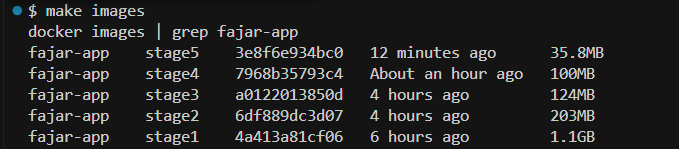

# Python Optimization

## 📦 File Size Optimization Report

Successfully reduce from 1.1GB to 35.8MB.

## 🔍 Overview

- **Original Size:** `1.1 GB`
- **Optimized Size:** `35.8 MB`
- ✅ **Reduction:** `≈ 96.75%`

## 📌 Calculation
Reduction = (Original Size - Reduced Size) / Original Size × 100%  
= (1100 MB - 35.8 MB) / 1100 MB × 100%  
= 1064.2 MB / 1100 MB × 100%  
≈ 96.75%

## 💡 Benefits

- 🚀 Faster uploads/downloads
- 💾 Lower storage requirements
- 🌐 Improved performance for web or data-heavy applications
